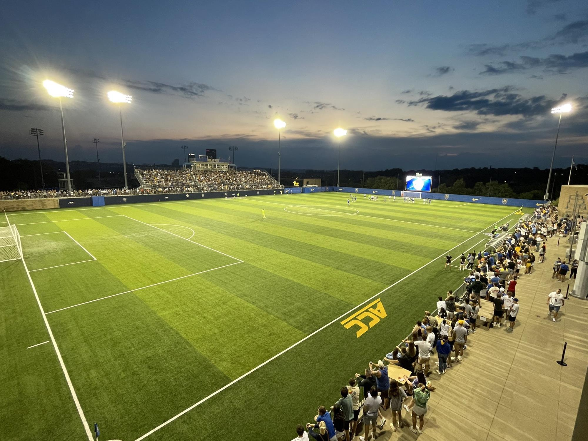

 
  <h1> Soccer Field Data Rotation and Cleaning  </h1> 
  
  

 

  <h2>  App Purpose </h2> 
  
  - Rotate raw catapult data to make it horizontal
   
  - This allows each game to be visualized in the same way creating unity between games
  
  - Connect First half and second half data, and if necessary, data from overtimes
  
  - Allow game data to be analyzed correctly across full game
  

 

